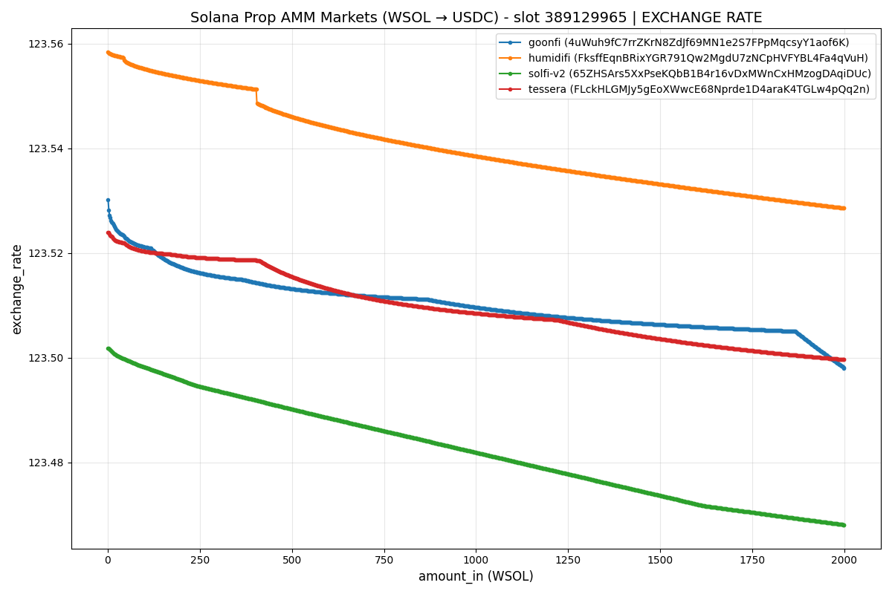
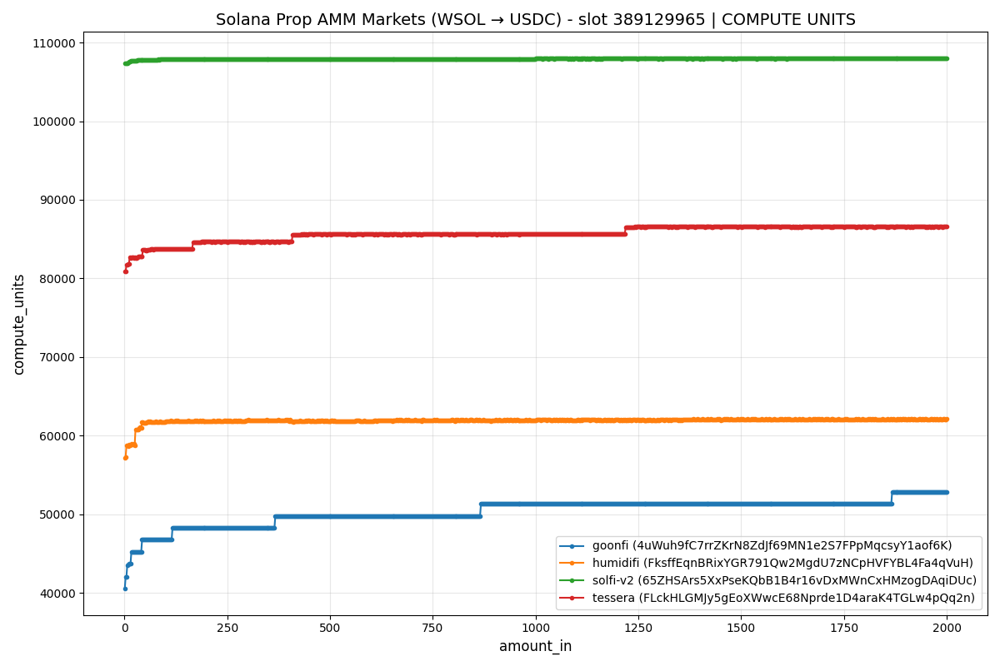

# pmm-sim

Simulation & Benchmark environment for Solana's Proprietary AMMs. The setup relies on [Litesvm](https://crates.io/crates/litesvm) for local, consistent and expedited execution. Additionally, since some proprietary AMMs block swaps originating from direct offchain calls, we rely on a custom onchain router - [Magnus](https://github.com/limechain/magnus) - to facilitate the swap execution.

Supported Prop AMMs:

- [x] Humidifi
- [x] SolfiV2
- [x] ObricV2
- [x] Zerofi
- [x] TesseraV
- [x] Goonfi

The swaps can be done either with the local static accounts that can be found at [cfg/accounts](./cfg/accounts) or with the current live accounts (by fetching them on-the-go). By default all swaps & benchmark simulations are done with live accounts.

Possible modes of execution include:

- **single** - Run a single swap route across one or more Prop AMMs with specified weights.
- **multi** - Execute swaps across nested Prop AMM routes. Each inner list represents a single route, each route possibly going through multiple Prop AMMs.
- **fetch-accounts** - Fetch accounts for specified PMMs via RPC and save them locally (presumably for later usage).
- **benchmark** - Benchmark swaps for any one of the implemented Prop AMMs by specifying, optionally, the accounts, src/dst tokens and step size. Benchmark data can be visualised with [plot.py](./scripts/plot.py).

```
$ pmm-sim --help

Simulation environment for Solana Proprietary AMM swaps.
Simulate Swaps across *any* of the major Solana Prop AMMs.

Usage: pmm-sim <COMMAND>

Commands:
  single          Run a single swap instruction across one or more Prop AMMs with specified weights.
  multi           Execute multiple swap instructions across nested Prop AMM routes. Each inner list represents a single instruction, each instruction possibly going through multiple Prop AMMs.
  fetch-accounts  Fetch accounts from the specified Pmms via RPC and save them locally (presumably for later usage).
  benchmark       Benchmark swaps for any one of the implemented Prop AMMs by specifying, optionally, the accounts, src/dst tokens and step size
  help            Print this message or the help of the given subcommand(s)

Options:
  -h, --help     Print help
  -V, --version  Print version
```

Check out the CLI subcommands help for additional clues (i.e `pmm-sim single --help`)

Accounts are by default loaded (saved) from (at) [cfg/accounts](./cfg/accounts). Tweaking the source/destination is possible via `--accounts-path` or `ACCOUNTS_PATH` env variable.

Programs are by default loaded (saved) from (at) [cfg/programs](./cfg/programs). Tweaking the source/destination is possible via `--programs-path` or `PROGRAMS_PATH` env variable.

Datasets are by default loaded (saved) from (at) [cfg/datasets](./cfg/datasets). Tweaking the source/destination is possible via `--datasets-path` or `DATASETS_PATH` env variable.

Exchange rate & CU plots for benchmarked swaps at slot 389129965:



## Examples

### Single-route swaps

##### Swap 100 WSOL for USDC using Humidifi

```
cargo r -- single --amount-in=100 --pmms=humidifi --weights=100
```

##### Swap 150,000 USDC for WSOL using Tessera and SolfiV2, in a route, split evenly - 75000 USDC per Prop AMM

```
cargo r -- single --pmms=tessera,solfi-v2 --weights=50,50 --amount-in=150000 --src-token=USDC --dst-token=WSOL
```

##### Swaps 10,000 USDC for USDT using ObricV2

```
cargo r -- single --amount-in=10000 --pmms=obric-v2 --weights=100 --src-token=USDC --dst-token=USDT
```

### Multi-route swaps

##### Swap 103 WSOL for USDC in a multi-route swap, 100 WSOL via Humidifi and SolfiV2 (split 92%/8%) in one route, and 3 WSOL via SolfiV2 in another route

```
cargo r -- multi --pmms="[[humidifi,solfi-v2],[humidifi]]" --weights "[[92, 8],[100]]" --amount-in=100,3
```

### Benchmark swaps

##### Execute swaps on Tessera, from 1 to 4000 WSOL to USDC, in increments of 1 WSOL, and save the results at [./dataset](./dataset).

```
cargo r -- benchmark --step=1,4000,1 --pmms=tessera --src-token=wsol --dst-token=usdc
```

##### Execute swaps on Humidifi, Tessera, SolfiV2 and Goonfi, from 1 to 1000 USDC to WSOL, in increments of 1 USDC, and save the results at [./dataset](./dataset).

```
cargo r -- benchmark --step=1,1000,1 --pmms=humidifi,tessera,solfi-v2,goonfi --src-token=usdc --dst-token=wsol
```

### Fetch live accounts

##### Locally sync the current (live) accounts for all supported Prop AMMs

```
cargo r -- fetch-accounts
```

##### Locally sync the current (live) accounts for Humidifi and SolfiV2

```
cargo r -- fetch-accounts --pmms=humidifi,solfi-v2
```
