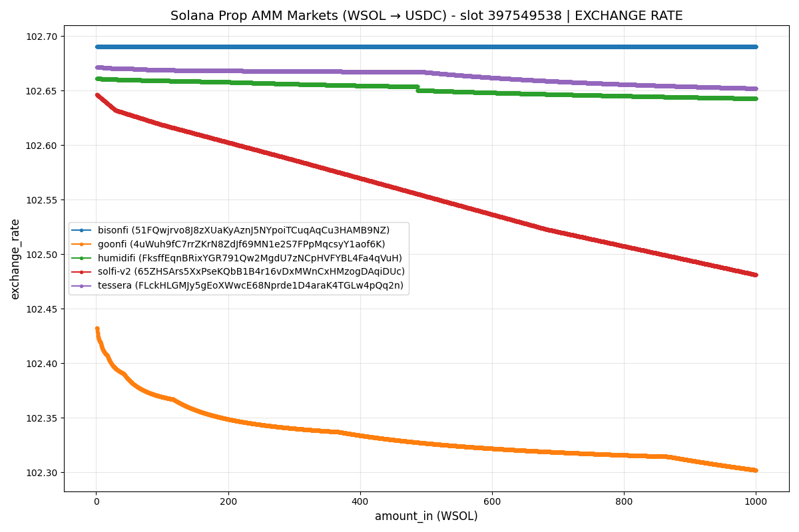
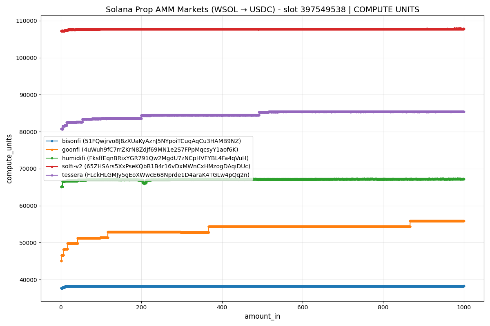

# pmm-sim

Simulation & Benchmark environment for Solana's Proprietary AMMs. The setup relies on [Litesvm](https://crates.io/crates/litesvm) for local, consistent and expedited execution. Additionally, since some proprietary AMMs block swaps originating from direct offchain calls, we rely on a custom router program - [magnus-router](https://github.com/LimeChain/magnus/tree/master/crates/router) - to facilitate the swap execution.

Supported Prop AMMs:

- [x] HumidiFi
- [x] SolFiV2
- [x] ObricV2
- [x] ZeroFi
- [x] TesseraV
- [x] GoonFi
- [x] BisonFi

The swaps can be done either with the local static accounts that can be found at [cfg/accounts](./cfg/accounts) or with the current live accounts (by fetching them on-the-go). By default all swaps & benchmark simulations are done with live accounts. The markets are specified in [setup.toml](./setup.toml).

Possible modes of execution include:

- **single** - Run a single swap route across one or more Prop AMMs with specified weights.
- **multi** - Execute swaps across nested Prop AMM routes. Each inner list represents a single route, each route possibly going through multiple Prop AMMs.
- **fetch-accounts** - Fetch accounts for specified PMMs via RPC and save them locally (presumably for later usage).
- **benchmark** - Benchmark swaps for any of the implemented Prop AMMs by specifying, optionally, the accounts, src/dst tokens and range size. Benchmark data can be visualised with [plot.py](./scripts/plot.py).

Exchange rate & CU plots for benchmarked swaps at slot `397549538`:


_Figure 1: Exchange rate for benchmarked swaps_


_Figure 2: Compute unit usage_

All datasets are saved as `parquet` and available at [datasets](./datasets). To peek at the data through cli:

```sh
duckdb -csv \
    -c "SELECT * FROM 'datasets/389129965_goonfi_4uWuh9fC7rrZKrN8ZdJf69MN1e2S7FPpMqcsyY1aof6K_20251225-212154.parquet'" \
    | column -t -s ,
```

## Examples

First build the project

```
cargo build --release
```

### Single-route swaps

##### Swap 15K USDC for WSOL using HumidiFi.

```
./target/release/pmm-sim single --amount-in=15000 --pmms=humidifi --weights=100 --src-token=USDC --dst-token=WSOL
```

##### Swap 69K USDC for WSOL using HumidiFi and BisonFi, in one route, split 25%,75% accordingly.

```
./target/release/pmm-sim single --amount-in=69000 --pmms=humidifi,bisonfi --weights=25,75 --src-token=USDC --dst-token=WSOL
```

##### Swap 375 WSOL for USDC using Tessera and SolFiV2, in one route, split evenly - 187,5 WSOL per Prop AMM.

```
./target/release/pmm-sim single --amount-in=375 --pmms=tessera,solfi-v2 --weights=50,50 --src-token=WSOL --dst-token=USDC
```

##### Swap 100 WSOL for USDC using SolFiV2, HumidiFi, and Tessera, in one route, split 33,33,34 WSOL per Prop AMM.

```
./target/release/pmm-sim single --amount-in=100 --pmms=solfi-v2,humidifi,tessera --weights=33,33,34 --src-token=WSOL --dst-token=USDC --jit-accounts=false
```

##### Swaps 10,000 USDC for USDT using ObricV2.

```
./target/release/pmm-sim single --amount-in=10000 --pmms=obric-v2 --weights=100 --src-token=USDC --dst-token=USDT
```

### Multi-route swaps

##### Swap 103 WSOL for USDC in a multi-route swap, 100 WSOL via HumidiFi and SolFiV2 (split 92%/8%) in one route, and 3 WSOL via Tessera in another route.

```
./target/release/pmm-sim multi --amount-in=100,3 --pmms="[[humidifi,solfi-v2],[tessera]]" --weights="[[92,8],[100]]"
```

##### Execute two routes, the first swapping 150,000 USDC for WSOL using HumidiFi and SolFiV2 (split 25%/75%), the second swapping 1000 USDC for WSOL using GoonFi.

```
RUST_LOG=debug ./target/release/pmm-sim multi --amount-in=150000,1000 --pmms="[[humidifi,solfi-v2],[goonfi]]" --weights="[[25,75],[100]]" --src-token=USDC --dst-token=WSOL --jit-accounts=true
```

### Benchmark swaps

##### Benchmark swaps on HumidiFi,Tessera,SolFiV2 and GoonFi, from 1 to 4000 WSOL to USDC, in increments of 1 WSOL. The results are saved at [./datasets](./datasets).

```
./target/release/pmm-sim benchmark --pmms=humidifi,tessera,solfi-v2,goonfi --range=1.0,4000.0,1.0 --src-token=wsol --dst-token=usdc
```

##### Benchmark swaps on Tessera and SolFiV2, from 1 to 250 WSOL, in increments of 0.01 WSOL. The results are saved at [./datasets](./datasets).

```
./target/release/pmm-sim benchmark --pmms=tessera,solfi-v2 --range=1.0,250.0,0.01 --src-token=wsol --dst-token=usdc
```

##### Benchmark swaps (USDC->WSOL) on HumidiFi and SolFiV2, from 10K to 100K USDC, in increments of 100 USDC. The results are saved at [./datasets](./datasets).

```
./target/release/pmm-sim benchmark --pmms=humidifi,solfi-v2 --range=10000,100000,100 --src-token=usdc --dst-token=wsol
```

Generated benchmark data can be plotted through [./scripts/plot.py](./scripts/plot.py), like so:

##### Plot the datasets for slot `389141713`.

```
./scripts/plot.py ./datasets/389141713*
```

### Fetch live accounts

##### Locally sync the current (live) accounts for all supported Prop AMMs.

```
./target/release/pmm-sim fetch-accounts
```

##### Locally sync the current (live) accounts for HumidiFi and SolFiV2.

```
./target/release/pmm-sim fetch-accounts --pmms=humidifi,solfi-v2
```

---

Accounts are by default loaded (saved) from (at) [cfg/accounts](./cfg/accounts). Tweaking the source/destination is possible via `--accounts-path` or `ACCOUNTS_PATH` env variable.

Programs are by default loaded (saved) from (at) [cfg/programs](./cfg/programs). Tweaking the source/destination is possible via `--programs-path` or `PROGRAMS_PATH` env variable.

Datasets are by default loaded (saved) from (at) [datasets](./datasets). Tweaking the source/destination is possible via `--datasets-path` or `DATASETS_PATH` env variable.

---

Check out the CLI subcommands for additional clues (i.e `pmm-sim single --help`)

```
$ pmm-sim --help

Simulation environment for Solana's Proprietary AMMs.
Simulate swaps and Benchmark performance across *any* of the major Solana Prop AMMs.

Usage: pmm-sim <COMMAND>

Commands:
  single          Run a single swap route across one or more Prop AMMs with specified weights.
  multi           Execute multiple swap routes across nested Prop AMM routes. Each inner list represents a single route, each route possibly going through multiple Prop AMMs.
  fetch-accounts  Fetch accounts from the specified Pmms via RPC and save them locally (presumably for later usage).
  benchmark       Benchmark swaps for any one of the implemented Prop AMMs by specifying, optionally, the accounts, src/dst tokens and step size
  help            Print this message or the help of the given subcommand(s)

Options:
  -h, --help     Print help
  -V, --version  Print version
```
